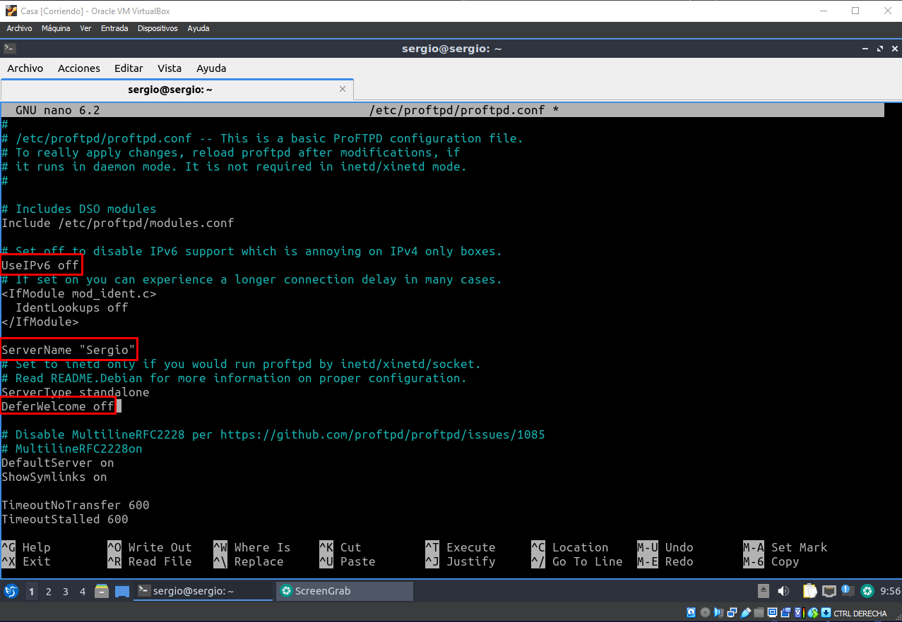
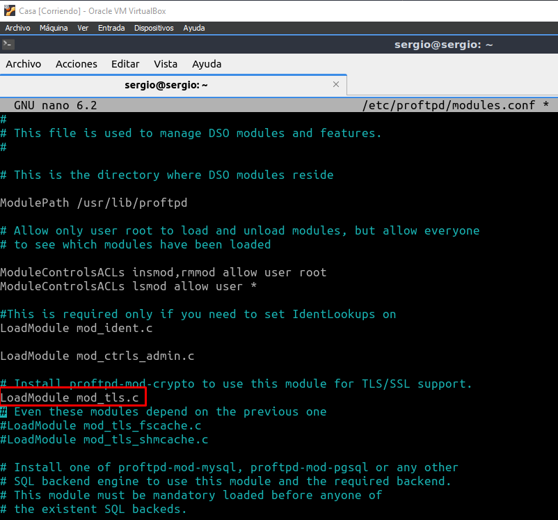

# Tarea 03 · Despliegue de Aplicaciones Web
___
## Oliver Fabian Stetcu Stepanov
___
### Tarea FTP
___
# Servicio de transferencia de ficheros
___
## ProFTP

http://www.proftpd.org/

# Infraestructura

Reutilizaremos las MV de la práctica de ``ssh``. Dos MV dentro de una ``red NAT``:
* **Servidor**: con un Ubuntu server sin entorno gráfico.
    * Usuario: ``sergio``, contraseña: ``sergio``.
* **Casa**: con un Lubuntu con el entorno gráfico por defecto (LXQt).
    * Usuario: ``carmen``, contraseña: ``carmen``.

Desde el equipo **Casa** nos conectaremos al equipo **Servidor** mediante una conexión ``ssh`` autentificándonos mediante claves asimétricas ``ed25519``.

## Instalación y uso básico

1. Acceder al servidor:

Desde el equipo de **Casa** ejecutamos el siguiente comando:

```bash
ls -la .ssh
cd ~/.ssh
ssh -p 22 -i clave_trabajo sergio@10.0.2.8
```

Utilizo la clave generada en la Tarea 01 (Tarea SSH - SCP - Shell - VirtualBox), la clave se llama "**clave_trabajo**" (se puede omitir poner el puerto "-p 22"):

Resultado:


> Casi toda la instalación y configuración la debemos hacer con privilegios de administrador podemos ejecutar ``sudo`` en todas las instrucciones o cambiar al usuario administrador ``sudo su``.

2. Instalar proftpd:

```bash
sudo apt update
sudo apt install proftpd
```

Resultado:


3. Realizar algunos cambios en el archivo de configuración:

```bash
sudo nano /etc/proftpd/proftpd.conf
```

Resultado:


Cambio el nombre del servidor. Desactivo el protocolo IP versión 6. Y no muestro el mensaje de bienvenida hasta que el usuario no se haya autentificado
correctamente.



La último modificación solicitada ya estaba desactivada por defecto, no he tenido que cambiar nada, pero en las otras 2 sí.

Guardamos los cambios.

> Puedes obtener más información sobre las distintas directivas de configuración en: http://www.proftpd.org/docs/directives/configuration_full.html. Revisa las directivas: ``DeferWelcome``, ``DisplayConnect``, ``DisplayLogin``, ``DisplayChdir``, ``DisplayGoAway``, ``DisplayQuit``, ``AccessGrantMsg`` y ``AccessDenyMsg``.

4. Comprobar estado del servicio proftpd:

```bash
sudo systemctl status proftpd
```

Resultado:


Podemos comprobar que el servicio está activo.

5. Con los siguientes comandos lo activaremos para que se inicie al arrancar el servidor y lo iniciaremos:

```bash
sudo systemctl enable proftpd
sudo systemctl start proftpd
```

Resultado:


> Otras comandos del servicio son:
>* sudo systemctl enable proftpd
>* sudo systemctl start proftpd
>* sudo systemctl stop proftpd
>* sudo systemctl restart proftpd
>* sudo systemctl status proftpd
>* sudo systemctl reload proftpd
>* sudo systemctl show proftpd

6. Reglas firewall:

```bash
sudo ufw enable
sudo ufw allow 20/tcp
sudo ufw allow 21/tcp
sudo ufw status
```

Resultado:


7. Probar desde el cliente qué puertos tiene abiertos el servidor, en nuestro ejemplo desde el equipo **Casa** ejecutaremos:

Si no tengo instalada esta utilidad, la instalaré con: ``sudo apt install nmap``. Esta comprobación también se puede hacer desde el propio servidor, pero es menos fiable que desde otro equipo ya que puede conectarse por localhost.

```bash
exit
sudo apt install nmap
nmap 10.0.2.8 -p 1-1024
```

Resultado:


8. Conexión FTP desde el cliente, en nuestro ejemplo el equipo **Casa**. (-A: forzar modo activo):

> Para evitar problemas con el firewall en todo momento utilizaremos el modo de transferencia 'activo'. Este modo utiliza unicamente los puertos 20 y 21 del servidor.

```bash
ftp -A 10.0.2.8
ls
```

Resultado:


9. Comprobar en el equipo **Servidor** qué conexiones están establecidas con otros equipos:

```bash
ssh -p 22 -i clave_trabajo sergio@10.0.2.8
ss |grep tcp
```

Resultado:


10. Instalar el cliente gráfico **Filezilla** en el equipo **Casa**. Crea una nueva conexión en el **Gestor de sitios**. Conectarse al equipo **Servidor** con el protocolo FTP y cifrado FTP plano. Recuerda conectar el modo **activo** en la pestaña **Opciones de transferencia** del Gestor de sitios.

```bash
exit
sudo apt install filezilla
```

Salgo del equipo "**Servidor**", y en "**Carmen**" me instalo el "**Filezilla**" y lo abro.


Creo una nueva conexión en el "**Gestor de sitios**". Me conexto al equipo **Servidor** con el protocolo FTP y cifrado FTP plano.


Le asigno el protocolo "**FTP**", en **Servidor** pongo la ip del equipo **Servidor** (en mi caso, 10.0.2.8), el puerto sería el ``21`` pero si no ponemos nada y lo dejamos en blanco lo pilla también, en modo de cifrado selecciono "**FPT Plano**", modo de acceso "**Normal**", usuario "**sergio**" y en contraseña "**sergio**".


Conecto el modo **activo** en la pestaña **Opciones de transferencia** del Gestor de sitios.


Y nos conectamos:


Conexión establecida:


## Configurar una cuenta anónima
1. Volvemos a realizar algunos cambios en el archivo de configuración:

Cambiamos al equipo "**Servidor**". Vamos a la terminal y ejecutamos el siguiente comando:

```bash
sudo nano /etc/proftpd/proftpd.conf
```

Descomentamos todo el bloque ``<Anonymous ~ftp>`` de modo que quede de la siguiente forma:


Guardamos los cambios realizados.

2. Reiniciaremos el servicio ``proftpd``:

```bash
sudo systemctl restart proftpd
```


3. Puedes probar que los archivos de configuración son correctos con el siguiente comando:

```bash
sudo /usr/sbin/proftpd --configtest -c /etc/proftpd/proftpd.conf
```


4. Prueba que puedes acceder al servidor sin escribir contraseñas usando los dos usuarios anónimos: anonymous y ftp. Realiza la prueba tanto desde el teminal como desde la aplicación gráfica filezilla.

> Realmente al instalar ProFTP se crea el usuario ``ftp``, anonymous es un alias de este usuario. Puedes verlo en la directiva ``UserAlias`` del bloque ``<Anonymous >`` del archivo de configuración. Además puedes ver que este usuario existen en el sistema en el archivo de usuarios: ``sudo cat /etc/passwd``.

Vamos a realizarlo desde el terminal de la siguiente manera:

Primero nos cambiamos al equipo "**Carmen**". Y ejecutamos los siguientes comandos para intentar acceder al equipo "**Servidor**" de forma anónima:

```bash
ftp -A 10.0.2.8
ls
```

Como usuario insertamos "**anonymous**", y sin contraseña y le damos a enter.


Ahora hacemos lo mismo pero con el usuario "**ftp**", ejecutamos los siguientes comandos:

```bash
ftp -A 10.0.2.8
ls
```

Como usuario insertamos "**ftp**", y sin contraseña y le damos a enter.


Ahora vamos a realizarlo desde el cliente gráfico de "**Filezilla**" de la siguiente forma:

Creo los **sitios** para establecer la conexión con el "**Servidor**":


Establezco como la última vez todas las opciones pero esta vez cambiamos el modo de acceso a modo "**anónimo**":


Y nos intentamos conectar:


Ahora hacemos lo mismo pero con el usuario "**ftp**":


Y nos intentamos conectar:


Estos serían los sitios que tenemos creados en total hasta ahora:


5. Si queremos que el usuario anónimo tenga una carpeta diferente, tenemos que crear dicha carpeta.

Cambiamos al equipo "**Servidor**" y ejecutamos los comandos,

```bash
sudo mkdir -p /var/ftp/anonimo
sudo chown ftp:nogroup /var/ftp/anonimo
```

Resultado:


6. Después debes indicarlo en el fichero de configuración, cambiando la etiqueta ``<Anonymous ~ftp>`` por ``<Anonymous /nombre-de-carpeta>``. Por ejemplo: ``<Anonymous /var/ftp/anonimo>``.

Para ello, ejecutamos el siguiente comando y realizamos lo que nos pide:

```bash
sudo nano /etc/proftpd/proftpd.conf
```


7. Para saber que estamos en esta nueva carpeta, le vamos a crear un fichero dentro:

> Otra opción sería crear/modificar el archivo ``welcome.msg`` que nos indica la directiva ``DisplayLogin``.


8. Recuerda reinicia el servicio ``proftpd``:

```bash
sudo systemctl restart proftpd
```


9. Puedes probar que los archivos de configuración son correctos con el siguiente comando:

```bash
sudo /usr/sbin/proftpd --configtest -c /etc/proftpd/proftpd.conf
```


10. Vuelve a probar a acceder al servidor usando los usuarios: anonymous y ftp. Tanto desde el teminal como desde la aplicación gráfica filezilla. Esta vez debe aparecer el nuevo directorio de trabajo.

Vamos a realizarlo desde el terminal de la siguiente manera:

Primero nos cambiamos al equipo "**Carmen**". Y ejecutamos los siguientes comandos para intentar acceder al equipo "**Servidor**" de forma anónima:

```bash
ftp -A 10.0.2.8
ls
```

Como usuario insertamos "**anonymous**", y sin contraseña y le damos a enter.


Ahora hacemos lo mismo pero con el usuario "**ftp**", ejecutamos los siguientes comandos:

```bash
ftp -A 10.0.2.8
ls
```

Como usuario insertamos "**ftp**", y sin contraseña y le damos a enter.


Ahora vamos a realizarlo desde el cliente gráfico de "**Filezilla**" de la siguiente forma:

Establezco conexión con el usuario anónimo "anonymous":


Y ahora establezco conexión con el usuario anónimo "ftp":


## Configuración de usuarios virtuales

Los usuarios virtuales son aquellos que no son usuarios de sistema pero si tienen acceso a algunos recursos a través del servicio FTP. Los crearemos usando el comando ``ftpasswd``. Los usuarios y las contraseñas se almacenan en un fichero que vamos a crear en ``/etc/proftpd/ftpd.passwd``:

1. Primero vamos a crear las carpetas de trabajo que le vamos a asignar a cada usuario virtual:

```bash
sudo mkdir /var/ftp/ftp01
sudo mkdir /var/ftp/ftp02
sudo chown ftp:nogroup /var/ftp/ftp01 /var/ftp/ftp02
```

Nos conectamos desde "**Carmen**" al equipo "**Servidor**" y ejecutamos los comandos:


2. Ahora nos situamos en el directorio de configuración de ``proftpd`` y creamos un archivo vacío para generar los usuario virtuales.

```bash
cd /etc/proftpd/
sudo touch ftpd.passwd
ls
```


3. Después creamos los usuario virtuales ejecutando el comando ``ftpasswd``:

```bash
sudo ftpasswd --passwd --name=ftp01 --uid=3001 --gid=3001 --home=/var/ftp/ftp01 --shell=/bin/false

sudo ftpasswd --passwd --name=ftp02 --uid=3002 --gid=3002 --
home=/var/ftp/ftp02 --shell=/bin/false
```

Nos pedirá que introduzcamos la contraseña de los usuarios virtuales, yo le asignaré "**ftp01**" al primer usuario virtual y "**ftp02**" para el segundo usuario virtual.


4. Para saber que estamos en nuestra carpeta, le vamos a crear un fichero dentro de cada una:

```bash
sudo touch /var/ftp/ftp01/soyusuario1.txt
sudo touch /var/ftp/ftp02/soyusuario2.txt
```

> Otra opción sería crear en dicha carpeta un archivo ``.message`` tal como se indica en la directiva ``DisplayChdir`` del archivo de configuración.


5. A continuación necesimos modificar el archivo de configuración:

```bash
sudo nano /etc/proftpd/proftpd.conf
```

Descomentamos las líneas:

```bash
DefaultRoot ~
RequireValidShell off
```

> Revisad que haya un espacio entre la directiva y el valor. Si no os dará un error.


Y al final del archivo incluimos la siguiente directiva:

```bash
AuthUserFile /etc/proftpd/ftpd.passwd
```


6. Guardamos y reiniciamos el servicio ``proftpd``:

```bash
sudo systemctl restart proftpd
```


7. Puedes probar que los archivos de configuración son correctos con el siguiente comando:

```bash
sudo /usr/sbin/proftpd --configtest -c /etc/proftpd/proftpd.conf
```


8. Vuelve a probar a acceder al servidor usando los usuarios virtuales, tanto desde el teminal como desde la aplicación gráfica filezilla. Debe aparecer el archivo correspondiente de su directorio de trabajo.

Vamos a realizarlo desde el terminal de la siguiente manera:

Primero nos cambiamos al equipo "**Carmen**". Y ejecutamos los siguientes comandos para intentar acceder al equipo "**Servidor**" de forma anónima:

```bash
ftp -A 10.0.2.8
ls
```

Como usuario insertamos "**ftp01**", y la contraseña "**ftp01**" y le damos a enter.


Ahora hacemos lo mismo pero con el usuario "**ftp02**", ejecutamos los siguientes comandos:

```bash
ftp -A 10.0.2.8
ls
```

Como usuario insertamos "**ftp**", y la contraseña "**ftp02**" y le damos a enter.


Ahora vamos a realizarlo desde el cliente gráfico de "**Filezilla**" de la siguiente forma:

Creo los 2 sitios para cada usuario virtual que tenemos.

Para el usuario virtual "**ftp01**" haremos lo siguiente:

Establezco conexión con el usuario virtual "ftp01". Establezco como la última vez todas las opciones pero esta vez cambiamos el modo de acceso a modo "**Normal**":


Insertamos el usuario "**ftp01**" y la contraseña "**ftp01**". Y nos intentamos conectar:


Ahora hacemos lo mismo pero con el usuario virtual "**ftp02**":


Y nos intentamos conectar:


Estos serían los sitios que tenemos creados en total hasta ahora:


## Configuración de FTPS. FTP con TLS/SSL
1. Para utilizar una conexión segura primero debemos instalar en el servidor el paquete para hacer funcionar el módulo de criptografía en proftpd.

```bash
sudo apt install proftpd-mod-crypto
```

Vamos al equipo "**Servidor**" y ejecutamos los comandos, nos saldrá lo siguiente:


2. Ahora debemos activar dicho paquete en el archivo de configuración:
``/etc/proftpd/modules.conf``. Descomentar la directiva: ``LoadModule mod_tls.c``

```bash
sudo nano /etc/proftpd/modules.conf
```

Vamos al archivo de configuración y descomentamos la directiva propuesta en la actividad:



Guardo todos los cambios y salgo del archivo de configuración.

3. A continuación debemos instalar el paquete openssl para generar un certificado autofirmado.

```bash
sudo apt install openssl
```


4. Una vez instalado vamos a generar una ``clave RSA`` de ``2048 bit``. Guardaremos la clave privada en el directorio ``/etc/ssl/private/proftpd.key`` y la clave pública en ``/etc/ssl/certs/proftpd.crt``. Le daremos una caducidad de 365 días.

```bash
sudo openssl req -x509 -newkey rsa:2048 -sha256 -keyout 
/etc/ssl/private/proftpd.key -out /etc/ssl/certs/proftpd.crt -nodes -days 365
```

Al crear el certificado nos pedirá cierta información que tendremos que ir rellenando.


Ponemos los permisos adecuados a estos certificados:

```bash
sudo chmod 600 /etc/ssl/private/proftpd.key
sudo chmod 600 /etc/ssl/certs/proftpd.crt
```


5. A continuación debemos incluir el archivo ``tls.conf`` en el archivo de configuración ``proftpd.conf``. Editamos el archivo de configuración: ``/etc/proftpd/proftpd.conf``. Descomentar la línea: ``Include /etc/proftpd/tls.conf``

```bash
sudo nano /etc/proftpd/proftpd.conf
```


6. Ahora abrimos el archivo de configuración de TLS ``/etc/proftpd/tls.conf`` y descomentamos las siguientes líneas:

```bash
sudo nano /etc/proftpd/tls.conf
```


Con la directiva ``TLSRequired on`` establecemos que toda la comunicación con el servidor debe ser segura.

7. Reiniciamos el servicio ``proftpd``:

```bash
sudo systemctl restart proftpd
```


8. Puedes probar que los archivos de configuración son correctos con el siguiente comando:

```bash
sudo /usr/sbin/proftpd --configtest -c /etc/proftpd/proftpd.conf
```


9. Puedes probar que se establece la comunicación TLS entre el cliente **Casa** y el **Servidor** ejecutando el siguiente comando desde un terminal del equipo **Casa**:

```bash
sudo openssl s_client -connect 10.0.2.8:21 -starttls ftp
```


Me sale mucho texto diciendo que se conecta correctamente.

10. Vuelve a probar a acceder al servidor usando la conexión segura. Primero con la aplicación gráfica filezilla. Crea una nueva conexión en el gestor de sitios con el protocolo FTP y el cifrado 'Requiere FTP explícito sobre TLS'. Recuerda activar el modo de transferencia activa en la pestaña 'Opciones de transferencia'

Nos dirigimos a "**Filezilla**", creamos el sitio nuevo y establecemos la configuración que nos ha pedido en la actividad. Creo una nueva conexión en el gestor de sitios con el protocolo FTP y el cifrado 'Requiere FTP explícito sobre TLS':


Me aparece esta pestaña:


Y se realiza la conexión correctamente:


11. Para probar con el terminal debemos instalarnos un nuevo paquete ya que el comando básico ``ftp`` no permite certificados. Instala en el equipo **Casa** el paquete ``lftp``:

```bash
exit
sudo apt install lftp
```

Nos cambiamos al equipo **Casa** y ejecutamos el comando.


12. Ahora configura el comando ``lftp`` creando un archivo de configuración ``nano ~/.lftprc`` con el siguiente contenido:

```bash
set ftp:passive-mode off
set ftp:ssl-auth TLS
set ftp:ssl-force true
set ftp:ssl-protect-list yes
set ftp:ssl-protect-data yes
set ftp:ssl-protect-fxp yes
set ssl:verify-certificate no
```

Configuramos: el modo de transferencia en activo, forzamos el uso de ssl y la autentificación con TLS. Además como nuestro certificado en autofirmado establecemos que no se verifique el certificado.

Resultado:


13. Prueba a acceder desde el terminal con:

```bash
lftp sergio@10.0.2.8
```

Resultado:


## Oliver Fabian Stetcu Stepanov
