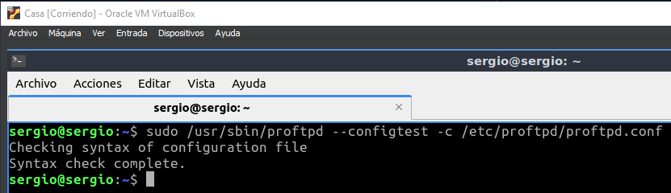
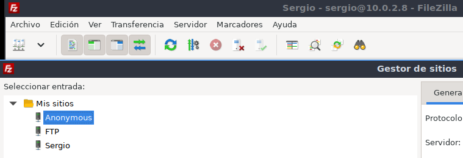

# Tarea 03 · Despliegue de Aplicaciones Web
___
## Oliver Fabian Stetcu Stepanov
___
### Tarea FTP
___
# Servicio de transferencia de ficheros
___
## ProFTP

http://www.proftpd.org/

# Infraestructura

Reutilizaremos las MV de la práctica de ``ssh``. Dos MV dentro de una ``red NAT``:
* **Servidor**: con un Ubuntu server sin entorno gráfico.
    * Usuario: ``sergio``, contraseña: ``sergio``.
* **Casa**: con un Lubuntu con el entorno gráfico por defecto (LXQt).
    * Usuario: ``carmen``, contraseña: ``carmen``.

Desde el equipo **Casa** nos conectaremos al equipo **Servidor** mediante una conexión ``ssh`` autentificándonos mediante claves asimétricas ``ed25519``.

## Instalación y uso básico

1. Acceder al servidor:

Desde el equipo de **Casa** ejecutamos el siguiente comando:

```bach
ls -la .ssh
cd ~/.ssh
ssh -p 22 -i clave_trabajo sergio@10.0.2.8
```

Utilizo la clave generada en la Tarea 01 (Tarea SSH - SCP - Shell - VirtualBox), la clave se llama "**clave_trabajo**" (se puede omitir poner el puerto "-p 22"):

Resultado:


> Casi toda la instalación y configuración la debemos hacer con privilegios de administrador podemos ejecutar ``sudo`` en todas las instrucciones o cambiar al usuario administrador ``sudo su``.

2. Instalar proftpd:

```bach
sudo apt update
sudo apt install proftpd
```

Resultado:


3. Realizar algunos cambios en el archivo de configuración:

```bach
sudo nano /etc/proftpd/proftpd.conf
```

Resultado:


Cambio el nombre del servidor. Desactivo el protocolo IP versión 6. Y no muestro el mensaje de bienvenida hasta que el usuario no se haya autentificado
correctamente.


La último modificación solicitada ya estaba desactivada por defecto, no he tenido que cambiar nada, pero en las otras 2 sí.

Guardamos los cambios.

> Puedes obtener más información sobre las distintas directivas de configuración en: http://www.proftpd.org/docs/directives/configuration_full.html. Revisa las directivas: ``DeferWelcome``, ``DisplayConnect``, ``DisplayLogin``, ``DisplayChdir``, ``DisplayGoAway``, ``DisplayQuit``, ``AccessGrantMsg`` y ``AccessDenyMsg``.

4. Comprobar estado del servicio proftpd:

```bach
sudo systemctl status proftpd
```

Resultado:


Podemos comprobar que el servicio está activo.

5. Con los siguientes comandos lo activaremos para que se inicie al arrancar el servidor y lo iniciaremos:

```bach
sudo systemctl enable proftpd
sudo systemctl start proftpd
```

Resultado:


> Otras comandos del servicio son:
>* sudo systemctl enable proftpd
>* sudo systemctl start proftpd
>* sudo systemctl stop proftpd
>* sudo systemctl restart proftpd
>* sudo systemctl status proftpd
>* sudo systemctl reload proftpd
>* sudo systemctl show proftpd

6. Reglas firewall:

```bach
sudo ufw enable
sudo ufw allow 20/tcp
sudo ufw allow 21/tcp
sudo ufw status
```

Resultado:


7. Probar desde el cliente qué puertos tiene abiertos el servidor, en nuestro ejemplo desde el equipo **Casa** ejecutaremos:

Si no tengo instalada esta utilidad, la instalaré con: ``sudo apt install nmap``. Esta comprobación también se puede hacer desde el propio servidor, pero es menos fiable que desde otro equipo ya que puede conectarse por localhost.

```bach
exit
sudo apt install nmap
nmap 10.0.2.8 -p 1-1024
```

Resultado:


8. Conexión FTP desde el cliente, en nuestro ejemplo el equipo **Casa**. (-A: forzar modo activo):

> Para evitar problemas con el firewall en todo momento utilizaremos el modo de transferencia 'activo'. Este modo utiliza unicamente los puertos 20 y 21 del servidor.

```bach
ftp -A 10.0.2.8
ls
```

Resultado:


9. Comprobar en el equipo **Servidor** qué conexiones están establecidas con otros equipos:

```bach
ssh -p 22 -i clave_trabajo sergio@10.0.2.8
ss |grep tcp
```

Resultado:


10. Instalar el cliente gráfico **Filezilla** en el equipo **Casa**. Crea una nueva conexión en el **Gestor de sitios**. Conectarse al equipo **Servidor** con el protocolo FTP y cifrado FTP plano. Recuerda conectar el modo **activo** en la pestaña **Opciones de transferencia** del Gestor de sitios.

```bach
exit
sudo apt install filezilla
```

Salgo del equipo "**Servidor**", y en "**Carmen**" me instalo el "**Filezilla**" y lo abro.


Creo una nueva conexión en el "**Gestor de sitios**". Me conexto al equipo **Servidor** con el protocolo FTP y cifrado FTP plano.


Le asigno el protocolo "**FTP**", en **Servidor** pongo la ip del equipo **Servidor** (en mi caso, 10.0.2.8), el puerto sería el ``21`` pero si no ponemos nada y lo dejamos en blanco lo pilla también, en modo de cifrado selecciono "**FPT Plano**", modo de acceso "**Normal**", usuario "**sergio**" y en contraseña "**sergio**".


Conecto el modo **activo** en la pestaña **Opciones de transferencia** del Gestor de sitios.


Y nos conectamos:


Conexión establecida:


## Configurar una cuenta anónima
1. Volvemos a realizar algunos cambios en el archivo de configuración:

Cambiamos al equipo "**Servidor**". Vamos a la terminal y ejecutamos el siguiente comando:

```bach
sudo nano /etc/proftpd/proftpd.conf
```

Descomentamos todo el bloque ``<Anonymous ~ftp>`` de modo que quede de la siguiente forma:


Guardamos los cambios realizados.

2. Reiniciaremos el servicio ``proftpd``:

```bach
sudo systemctl restart proftpd
```


3. Puedes probar que los archivos de configuración son correctos con el siguiente comando:

```bach
sudo /usr/sbin/proftpd --configtest -c /etc/proftpd/proftpd.conf
```



4. Prueba que puedes acceder al servidor sin escribir contraseñas usando los dos usuarios anónimos: anonymous y ftp. Realiza la prueba tanto desde el teminal como desde la aplicación gráfica filezilla.

> Realmente al instalar ProFTP se crea el usuario ``ftp``, anonymous es un alias de este usuario. Puedes verlo en la directiva ``UserAlias`` del bloque ``<Anonymous >`` del archivo de configuración. Además puedes ver que este usuario existen en el sistema en el archivo de usuarios: ``sudo cat /etc/passwd``.

Vamos a realizarlo desde el terminal de la siguiente manera:

Primero nos cambiamos al equipo "**Carmen**". Y ejecutamos los siguientes comandos para intentar acceder al equipo "**Servidor**" de forma anónima:

```bach
ftp -A 10.0.2.8
ls
```

Como usuario insertamos "**anonymous**", y sin contraseña y le damos a enter.


Ahora hacemos lo mismo pero con el usuario "**ftp**", ejecutamos los siguientes comandos:

```bach
ftp -A 10.0.2.8
ls
```

Como usuario insertamos "**ftp**", y sin contraseña y le damos a enter.


Ahora vamos a realizarlo desde el cliente gráfico de "**Filezilla**" de la siguiente forma:

Creo los **sitios** para establecer la conexión con el "**Servidor**":



Establezco como la última vez todas las opciones pero esta vez cambiamos el modo de acceso a modo "**anónimo**":


Y nos intentamos conectar:


Ahora hacemos lo mismo pero con el usuario "**ftp**":


Y nos intentamos conectar:


Estos serían los sitios que tenemos creados en total hasta ahora:


5. Si queremos que el usuario anónimo tenga una carpeta diferente, tenemos que crear dicha carpeta, por ejemplo:

```bach
sudo mkdir -p /var/ftp/anonimo
sudo chown ftp:nogroup /var/ftp/anonimo
```

E indicarlo en el fichero de configuración, cambiando la etiqueta ``<Anonymous ~ftp>`` por ``<Anonymous /nombre-de-carpeta>``. Por ejemplo: ``<Anonymous /var/ftp/anonimo>``.


5. A continuación debemos incluir el archivo tls.conf en el archivo proftpd.conf. Editamos el
archivo de configuración: /etc/proftpd/proftpd.conf. Descomentar la línea: Include
/etc/proftpd/tls.conf

